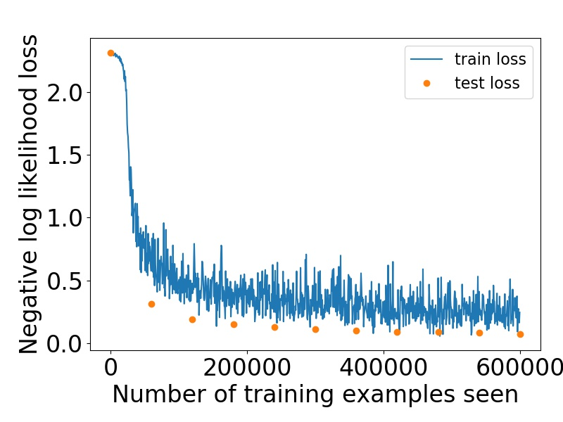

# ML-MNIST

The project was originally developed Ubuntu system (host). All libraries including pyTorch were already installed for previous projects.

Additionally, the app was tested with the CentOS 8 system. The CentOS system was installed in Virtualbox in Windows 10 system as the host system. In order to use such a configuration, one needs to perform steps described in next subsection.

## Installation in CentOS 8 in Virtualbox

1. Download CentOS image: http://mirror-pl.kielcetechnologypark.net/centos/8.2.2004/isos/x86_64/CentOS-8.2.2004-x86_64-dvd1.iso
2. Install image in Virtualbox: https://www.youtube.com/watch?v=HSPbwezgMno (software selection: workstation)
3. Download the solution from Github repository: git clone https://github.com/flukson/ML-MNIST.git
4. Install missing packages: pip3 install --user numpy torch torchvision
5. Test if application works properly: run ./mnist.py in ML-MNIST downloaded repository.

## Usage

The project investigates the MNIST dataset with the neural network developed with the PyTorch module.
It was based on following tutorials:

1. https://www.aiworkbox.com/lessons/load-mnist-dataset-from-pytorch-torchvision
2. https://nextjournal.com/gkoehler/pytorch-mnist

In order to run the project directly in the host system execute the following command:

```
./mnist.py
```

Then the application will run with default 'calculate' mode. Additionally there is the 'plot' mode to visualise losses. Also the number of epochs may be set with the command line option. To check all available options run command:

```
./mnist.py -h
```

## Installation and usage in Docker

In order to install the Docker in Cent OS 8 system, follow this tutorial: https://www.linuxtechi.com/install-docker-ce-centos-8-rhel-8/

In order to build the project with Docker, firstly build the cointainer:

```
docker build -t mnist .
```

and then run it:

```
docker run mnist
```

## Results

Results after 10 epochs for the test set:
- Avg. loss: 0.0748,
- Accuracy: 9778/10000 (98%).



